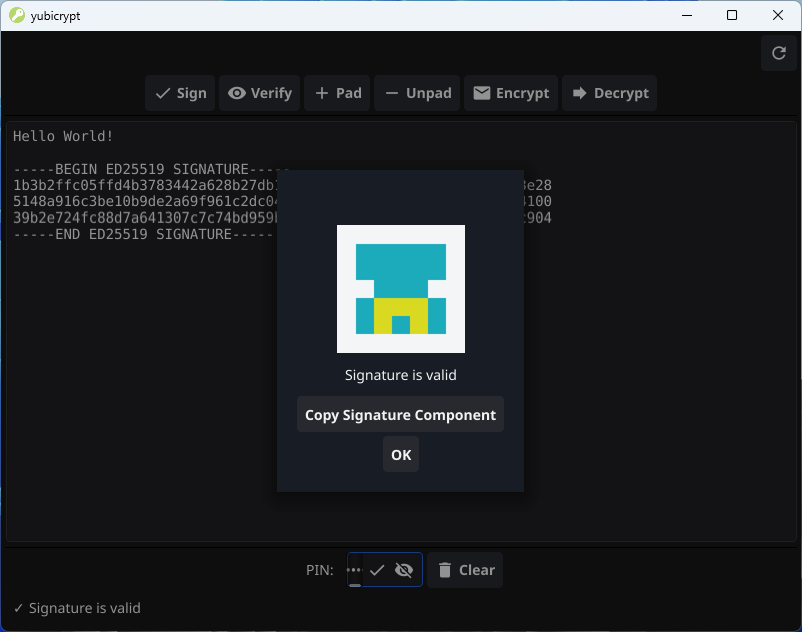

# yubicrypt

An easy to use public key encryption program for your YubiKey.

Supported YubiKey algorithms:

For encryption with slot 9d:

RSA: 2048, 3072, 4096 bits

For signing with slot 9c:

ECC: P-256, P-384, Ed25519

Simply use Yubico Authenticator to create your signing and   
encryption certificate and export your encryption certificate,     
to give it to your friends. You don't have to export your signing   
certificate, because it is not needed for signature verification.    

If you use Linux (Debian/Ubuntu) you may have to do the following  
in order that yubicrypt works.  

Install PC/SC daemon and tools  
sudo apt update  
sudo apt install pcscd pcsc-tools  
  
Start the PC/SC daemon   
sudo systemctl start pcscd  

Enable it to start automatically on boot  
sudo systemctl enable pcscd  

Check the status to ensure it's running  
sudo systemctl status pcscd  



If you like yubicrypt, as much as I do, consider a small donation.  
```  
BTC: 129yB8kL8mQVZufNS4huajsdJPa48aHwHz  
Nym: n1yql04xjhmlhfkjsk8x8g7fynm27xzvnk23wfys  
XMR: 45TJx8ZHngM4GuNfYxRw7R7vRyFgfMVp862JqycMrPmyfTfJAYcQGEzT27wL1z5RG1b5XfRPJk97KeZr1svK8qES2z1uZrS
```
Or, if you prefer, [buy me a coffee.](https://buymeacoffee.com/ch1ffr3punk)  
yubicrypt is dedicated to Alice and Bob.


